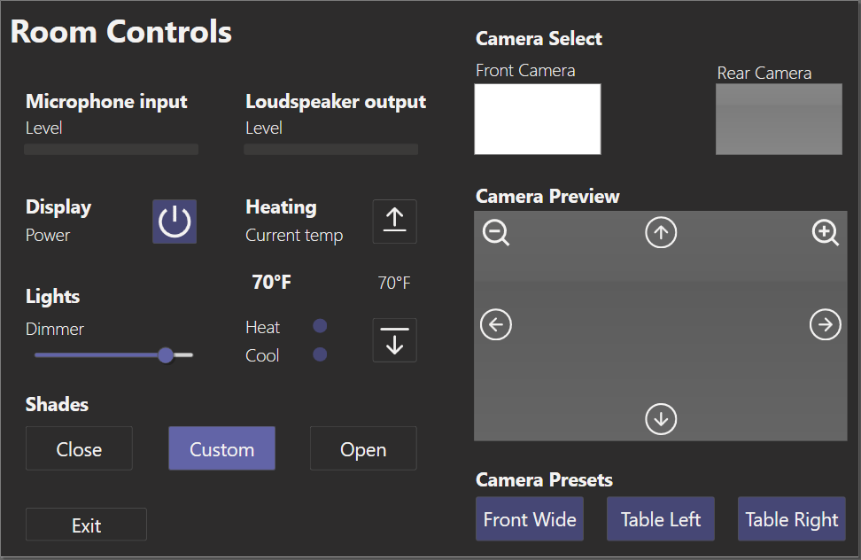

# Q-SYS-Public

Este repositorio es una colección de recursos relacionados con el ecosistema Q-SYS. Incluye plugins, módulos de diseño, hojas de estilo (CSS), documentación y más, diseñados para facilitar el trabajo con sistemas Q-SYS.

## 🚀 Propósito
El objetivo de este repositorio es centralizar y compartir recursos útiles para la comunidad de usuarios de Q-SYS, incluyendo herramientas desarrolladas tanto por fabricantes como por la comunidad.

## 📂 Estructura del repositorio

El repositorio está organizado en las siguientes carpetas:

- **CSS:** Hojas de estilo diseñadas para personalizar interfaces en sistemas Q-SYS.
- **DesignModules:** Módulos de diseño para interfaces y funcionalidades específicas.
- **Documentation:** Documentación relacionada con plugins y módulos.
- **Plugins:**
  - **QSC:** Plugins oficiales creados o aprobados por QSC.
  - **Community:** Plugins desarrollados por la comunidad.
  - **Users:** Plugins y herramientas específicas creadas por usuarios individuales.

## 📝 Cómo contribuir

1. **Reportar problemas:**
   - Usa la pestaña de [Issues](https://github.com/) para reportar errores o sugerir mejoras.
2. **Enviar nuevos recursos:**
   - Si tienes un plugin, módulo o recurso útil que quieras compartir, envíalo como un pull request siguiendo el formato de este repositorio.
3. **Documentación:** 
   - Asegúrate de incluir un archivo `README.md` en la carpeta de cada recurso con información básica (ver sección de documentación).

## 📜 Licencias

- Cada plugin, módulo o recurso tiene su propia licencia. Por favor, consulta la documentación individual antes de usar cualquier recurso.
- Si no se incluye una licencia explícita, se asumirá un uso **restringido a evaluación y pruebas**.

## 🛠️ Requisitos

- **Q-SYS Designer Software** versión compatible con el recurso (especificado en cada plugin o módulo).
- Algunos recursos pueden requerir hardware específico (ver documentación individual).

## 🖼️ Ejemplos

### **Ejemplo de diseño con CSS:**

---

### **Ejemplo de plugin:**
**Nombre:** Extron-Matrix  
**Versión:** 2.0.0.1  
**Descripción:** Plugin para el control de matrices Extron mediante sistemas Q-SYS.

---

## ✉️ Contacto

Si tienes preguntas o necesitas ayuda, puedes contactar a los administradores del repositorio mediante la sección de [Issues](https://github.com/).

¡Gracias por contribuir a la comunidad de Q-SYS!
